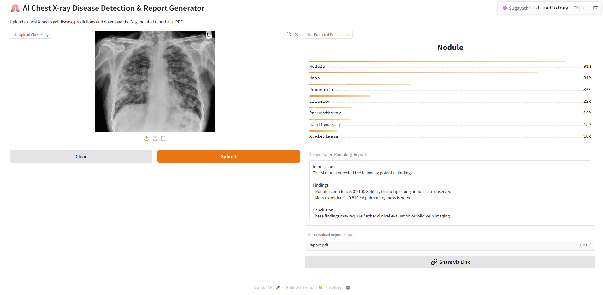

# 🧠 AI for Automated Radiology Report Generation
### Using Chest X-rays and Deep Learning  
*DATA 606 – Capstone in Data Science (Spring 2025)*  
**Team F**: Sugayathri Devi Ponnada, Ishita Reddy Annreddy, Deepika Bode

---

## 🔍 Project Overview

This project automates the detection of thoracic diseases from chest X-rays and generates human-readable radiology reports using deep learning.

We built a robust multi-label classifier and a lightweight NLP pipeline to support radiologists with faster, more consistent diagnoses.

---

## 📂 Dataset Summary

- **Dataset**: [CXR8-Selected (NIH ChestX-ray14 subset)](https://www.kaggle.com/datasets/myylee/cxr8-selected)  
- **Samples**: 112,120 frontal-view X-rays  
- **Diseases**: Focused on 7 classes: Effusion, Atelectasis, Pneumonia, Nodule, Mass, Cardiomegaly, Pneumothorax  
- **Preprocessing**: CLAHE contrast, grayscale normalization, multi-label binarization  
- **Source**: [Hosted on Hugging Face](https://huggingface.co/datasets/Sugayathri/crx8selected)

---

## 🧠 Modeling Approach

- 🔄 **5-Fold Multi-label Stratified Cross-Validation**
- 🧱 Ensemble of **DenseNet121** + **EfficientNet-B3**
- ⚖️ Custom class thresholds for disease detection
- 📝 PDF report generation using ReportLab
- 🧪 Test-time ensemble prediction

---

## 📊 Model Performance

| Metric         | Score     |
|----------------|-----------|
| **AUROC**      | 0.83      |
| **Macro F1**   | 0.51      |
| **Accuracy**   | 78.7%     |

🟢 **Fold 1** selected for deployment due to best balance of precision/recall.

---

## 🌐 Live Demo (Try It!)

🚀 [**Launch AI Radiology Web App**](https://huggingface.co/spaces/Sugayathri/ai_radiology)

- Upload a chest X-ray image  
- Get disease predictions  
- Download a structured PDF report  
- Powered by the trained ensemble model

---

## 🖼️ Sample Result from the AI Model

Below is a real example generated by our deployed AI model on Hugging Face:

> The system accurately detects thoracic abnormalities from chest X-rays and generates an automated radiology report.

---

## 💡 Challenges Faced

- Severe class imbalance in diseases like Pneumonia
- Weak supervision (label noise) in the NIH dataset
- Google Colab compute/memory limits during training
- Real-time inference latency & model optimization

---

## 🔮 What’s Next?

- 🔍 Add explainability features like Grad-CAM
- 🧠 Explore **ViT** or **Swin Transformers** for vision
- 🗣 Use **BioGPT/T5** for richer NLP report summaries
- 🏥 Collaborate with radiologists for clinical validation

---

## 🔗 GitHub & Code

📂 [View Full GitHub Repository](https://github.com/sugayathriponnada/DS606_TeamF_Ponnada_Annreddy_Bode_AI-RADIOLOGY_P3Final)

---

## 👋 Team Members

- Sugayathri Devi Ponnada  
- Ishita Reddy Annreddy  
- Deepika Bode  

© 2025 – Team F | UMBC DS606  
Built with ❤️ using GitHub Pages + Cayman theme
